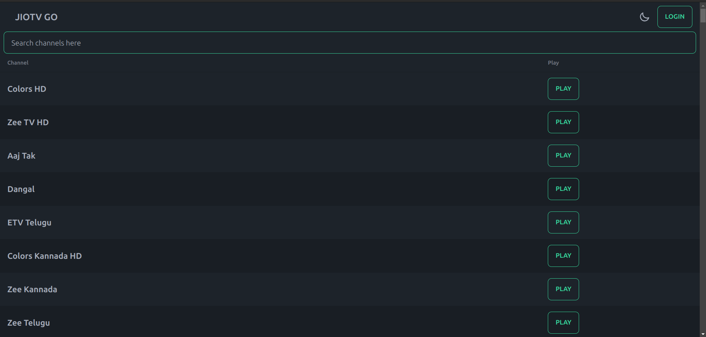
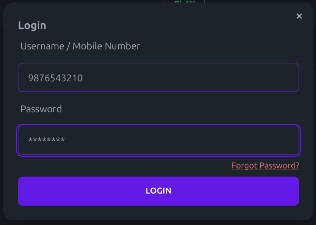
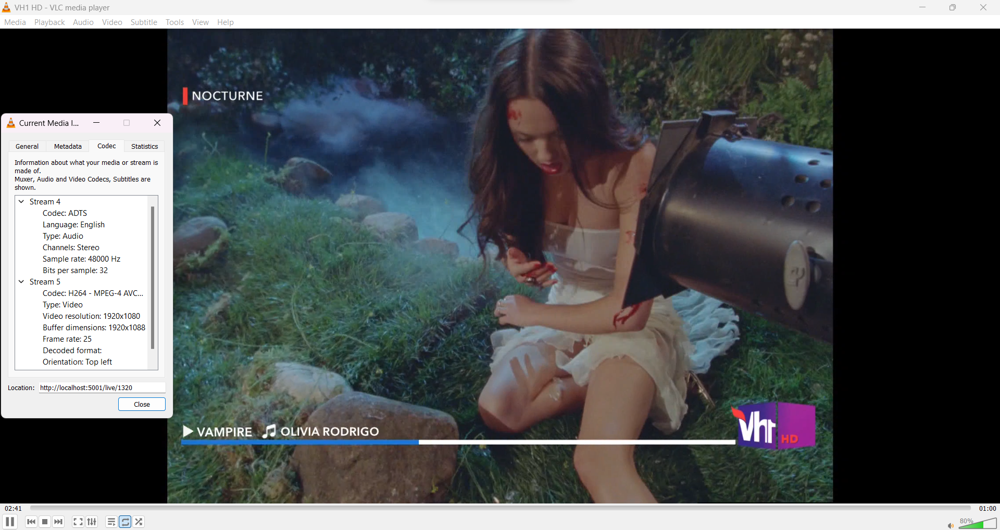

# JioTV Go

JioTV Go is a web application that allows you to watch Live TV channels. This project helps you to watch JioTV without the JioTV App. The project is currently in development and is made for educational purposes only.

Download the latest binary for your operating system from [here](https://github.com/rabilrbl/jiotv_go/releases/latest) and refer to [API endpoints](#api-endpoints) to use it.

## Table of Contents

- [JioTV Go](#jiotv-go)
  - [Table of Contents](#table-of-contents)
  - [Usage](#usage)
    - [How to use JioTV Go natively](#how-to-use-jiotv-go-natively)
    - [Android](#android)
    - [Docker](#docker)
    - [Optional Steps](#optional-steps)
    - [Remote Deployment](#remote-deployment)
  - [Web Paths](#web-paths)
  - [API Endpoints](#api-endpoints)
  - [Screenshots](#screenshots)
    - [Home Page](#home-page)
    - [Player Page](#player-page)
    - [Login Dialog](#login-dialog)
    - [Playing Live TV on VLC Media Player](#playing-live-tv-on-vlc-media-player)
  - [Usage from Source](#usage-from-source)
  - [License](#license)

## Usage

### How to use JioTV Go natively

1. Download the latest binary for your operating system from the [releases](https://github.com/rabilrbl/jiotv_go/releases/latest) page.
2. On Linux/Unix, Give executable permission to the binary. `chmod +x jiotv_go`
3. Run the binary. `./jiotv_go`.
4. Open `http://localhost:5001` in your browser.
5. Login to JioTV by clicking on the Login button.
6. Choose a channel and start watching.

### Android

> **Bug Notice**: Currently, the JioTV Go is not working on default termux due to some request error. Please use Andronix to run JioTV Go on Android for now.

1. Download [Termux](https://github.com/termux/termux-app/releases/latest) and [Andronix](https://andronix.app/)
2. On Termux, run `pkg up -y` 
3. Install latest Ubuntu from Andronix by copying the command from the app and pasting it in Termux.
4. Wait patiently for the installation to complete. And then run `./start-andronix.sh` to start Ubuntu. You will now be in the Ubuntu shell.
5. Copy download link of `linux-(arch)` bin file from [releases](https://github.com/rabilrbl/jiotv_go/releases/latest). Choose your aarch, mostly arm64.
6. Use `wget <link>` to download the file
7. Then follow [above steps](#how-to-use-jiotv-go) from 2 to 6

### Docker

1. Install [Docker](https://docs.docker.com/get-docker/).
2. `docker run -p 5001:5001 -v ./.jiotv_go/secrets:/app/secrets ghcr.io/rabilrbl/jiotv_go`
3. Open `http://localhost:5001` in your browser.

### Optional Steps

- If you want to specify a custom port or host, you can do so by passing the `host:port` or `:port` as an argument to the binary. `./jiotv_go "host:port"`
- If you want to specify the path/folder for `credentials.json`, set an environment variable `JIOTV_CREDENTIALS_PATH=/path` before running the binary.

### Remote Deployment

In cases where you want to deploy JioTV Go on a remote server, and if server doesn't have writable permissions to set the `credentials.json` file, you can use the following steps to deploy JioTV Go.

1. Login to JioTV on your local machine. This should generate `credentials.json`
2. Set the following environment variables on your remote server.
   - `JIOTV_SSO_TOKEN` - The `ssoToken` from the `credentials.json` file.
   - `JIOTV_CRM` - The `crm` from the `credentials.json` file.
   - `JIOTV_UNIQUE_ID` - The `uniqueId` from the `credentials.json` file.
  
> By setting above environment variables, the credentials.json will be ignored and the environment variables will be used instead.

## Web Paths

| Path | Description |
| --- | --- |
| `/` | Home Page |
| `/play/:channel_id` | Watch Channel with ID `channel_id` |
| `/player/:channel_id` | Embed Player for Channel with ID `channel_id` |

## API Endpoints

| Endpoint | Description |
| --- | --- |
| `/login?username=<username>&password=<password>` | Login to JioTV (Mandatory). If you forgot your password, you can use the [JioTV Password Recovery](https://www.jio.com/selfcare/signup/forgot-password) page to reset your password. |
| `/channels` | List of all channels |
| `/channels?type=m3u` | List of all channels in m3u format for IPTV and VLC Media Player |
| `/live/:channel_id` | Watch Live TV |

## Screenshots

### Home Page



### Player Page


### Login Dialog



### Playing Live TV on VLC Media Player



## Usage from Source

JioTV Go requires [Golang](https://golang.org/) to run.

Install the dependencies and start the server.

```sh
go mod download
go run ./cmd/jiotv_go
```

## License

Attribution-NonCommercial 4.0 International (CC BY-NC 4.0)

**Free Software, Hell Yeah!**. The project is open-source and free to use. Any attempt to sell this project will be considered a violation of the license and will be taken down immediately. If you notice any such activity, please report it to [me](mailto:rabil@rbls.eu.org).
