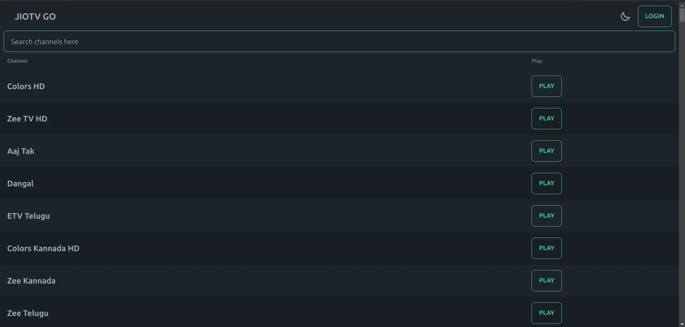

# Sneak Peek with Screenshots

Get a visual preview of JioTV Go with the following screenshots. These images showcase the various aspects of the application, including the Home Page, Player Page, Login Dialog, and playing Live TV on VLC Media Player.

## Home Page

*Description*: The Home Page is where your JioTV Go adventure begins. Explore the available channels and features right from the start.

## Player Page

*Description*: The Player Page is your window to watching live TV. Discover the user interface and features of JioTV Go's default player (Flowplayer).

## Login Dialog

*Description*: The Login Dialog allows you to log in to your JioTV Go account and access exclusive content.

## Playing Live TV on VLC Media Player

*Description*: JioTV Go also offers the option to play live TV on VLC Media Player, providing flexibility in how you choose to enjoy your favorite channels.

These screenshots offer a glimpse of what to expect when using JioTV Go. Explore further to experience the full range of features and capabilities.
